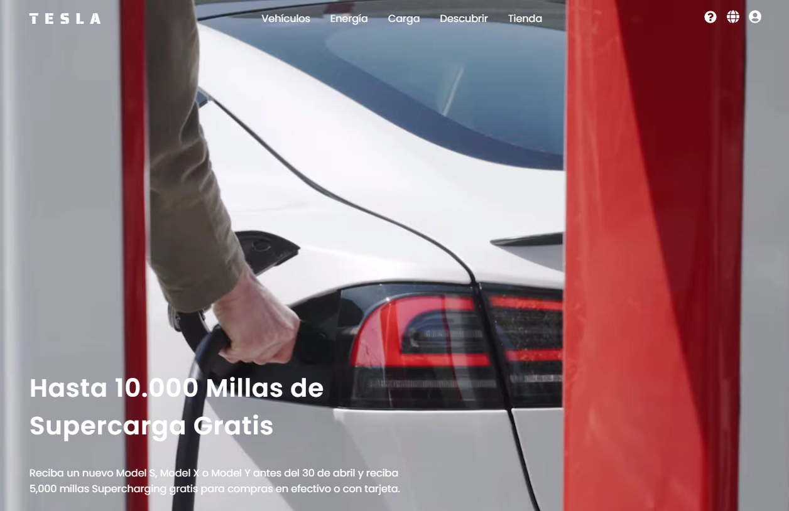

# Proyecto de Simulación de Página Tesla

Este proyecto es una simulación de la página web de Tesla. Ha sido creado con HTML, CSS y JavaScript.

## Descripción

El objetivo de este proyecto diseñar una landingpage con la apariencia y algunas funcionalidades básicas de la página web de Tesla para la practicar de habilidades de desarrollo web frontend.

## Características

- Página principal con diseño similar al de Tesla.
- Secciones para mostrar diferentes modelos de vehículos.
- Enlaces de navegación para acceder a las diferentes partes del sitio.

## Visita la página en:

https://tesla-adrian8.netlify.app

